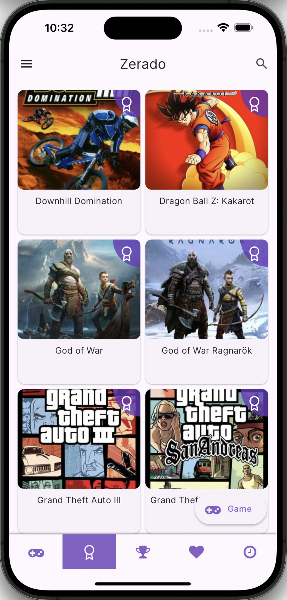
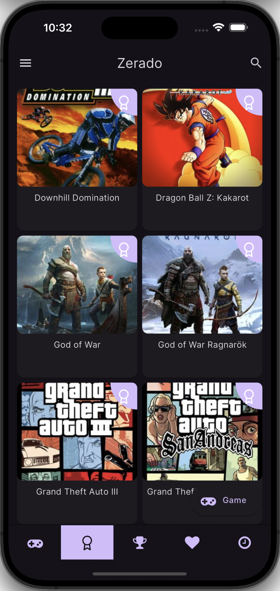
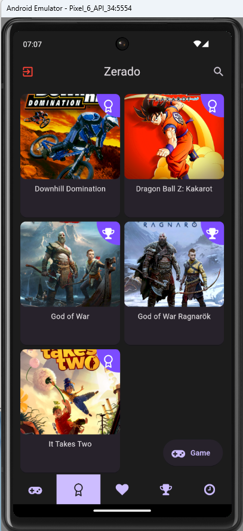
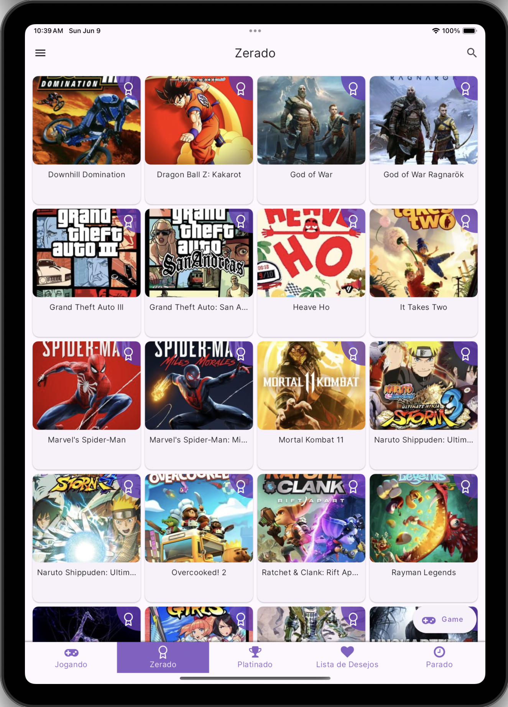
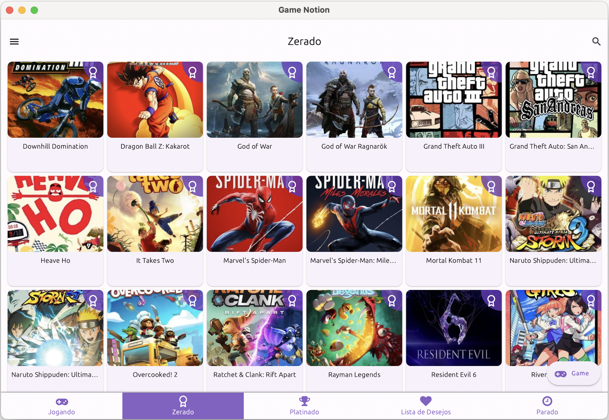

# Game Notion


Este é um aplicativo Flutter que utiliza o pacote GetX para gerenciamento de estado e integração com a API da Twitch e IGDB (Internet Game Database). O aplicativo permite aos usuários acessar informações sobre jogos, streams e outros conteúdos relacionados à Twitch, através da API da IGDB.

<br>

Além disso, este aplicativo permite que os dados do usuário sejam salvos no Firebase Storage, possibilitando o acesso a esses dados em outros dispositivos. Ele oferece suporte às plataformas Android, iOS, macOS, Windows e Linux.


### Features
✅ Change theme (system, light, dark)<br>
✅ Change primary color<br>
✅ Change fonte<br>

### Plataformas
✅ Android<br>
✅ IOS<br>
✅ MacOS<br>
✅ Windows<br>

<br>

<a href="https://github.com/welitonsousa/game_notation/raw/main/assets/files/android.apk">Baixe o app para Android 🤖</a>

<a href="https://github.com/welitonsousa/game_notation/raw/main/assets/files/game-notion.zip">Baixe o app para Windows 🪟</a>

<a href="mailto: welitonubuntu@gmail.com">Me envie um email para testar o app no testflight 🍎</a>

<br>

<h2 align="center">IOS</h2>
<p align="center">
    
    
</p>

<h2 align="center">Androd</h2>
<p align="center">
    
    
</p>

<h2 align="center">Ipad / Tablet</h2>
<p align="center">
    
</p>

<h2 align="center">MacOS</h2>
<p align="center">
    
</p>

<h2 align="center">Windows (DEMO)</h2>

<p align="center">
    

</p>


## Como executar:
- Adicione um arquivo na raiz do projeto chamado `firebase.json`. Este arquivo contém as configurações de autenticação para o Firebase. Você pode usar o arquivo `firebase.json.example` na raiz do projeto como exemplo para sua estrutura.

- Adicione outro arquivo em `/lib/core/settings/env.dart`. Este arquivo contém as variáveis de ambiente necessárias para o aplicativo. Você pode usar o arquivo `env.dart.example` em `/lib/core/settings/` como exemplo para sua estrutura.


```dart
flutter pub get
```
```dart
flutter run
```

<br>
<br>
<p align="center">
   Feito com ❤️ by <a href="https://welitonsousa.vercel.app" target="_blank"><b>welitonsousa</b></a>
</p>
